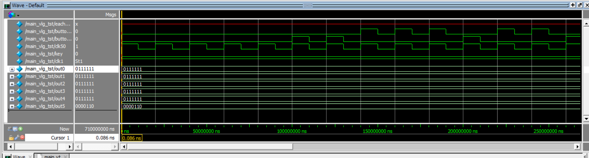
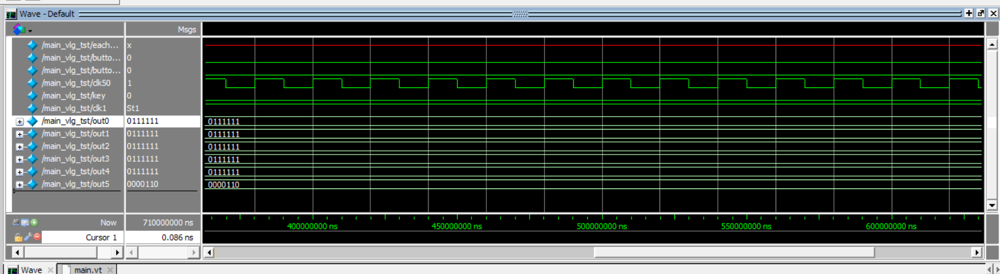
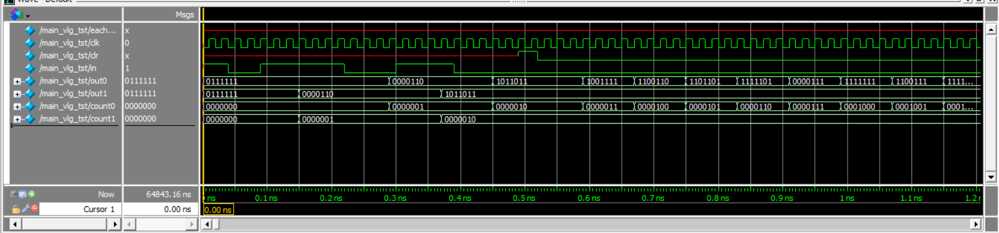
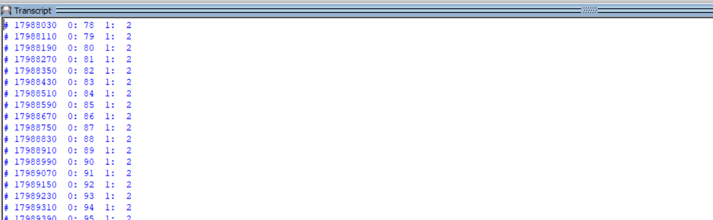
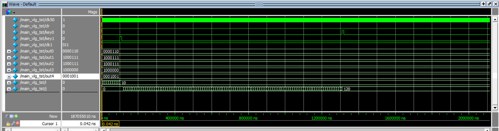

# 上机实验三：基本时序逻辑设计

---

- 通信1802  刘增运    学号：1808030220

---

## 第1题：字符移位

#### 逻辑描述

在8个7段管上显示HELLO_ _ _(可以显示下划线或不亮也可)，每隔1秒钟，字符序列左移或右移一个七段管的位置。系统外部时钟 50Mhz。左/右移位可以通过一个波动开关sw来控制。

| 信号类型 |                变量数据类型及位宽                 |                 变量含义                 |
| :------: | :-----------------------------------------------: | :--------------------------------------: |
|  input   |                    wire clk50                     |       系统外部的50MHz时钟信号输入        |
|  input   |                     wire sw0                      | 波动开关控制信号，sw=1时左移，sw=0时右移 |
|  output  |                     wire clk1                     |        由50MHz信号所转化的1Hz信号        |
|  output  | reg [6:0] out0,out1,out2,out3,out4,out5,out6,out7 |   7段管显示的信号，分别输出不同的符号    |

#### 模块代码

~~~ verilog
module main(clk50,sw,clk1,out0,out1,out2,out3,out4,out5,out6,out7);
    input clk50,sw;
    output wire clk1;
    output reg[6:0] out0=7'b1110110;  //显示H
    output reg[6:0] out1=7'b1111001;  //显示E
    output reg[6:0] out2=7'b0111000;  //显示L
    output reg[6:0] out3=7'b0111000;  //显示L
    output reg[6:0] out4=7'b0111111;  //显示O
    output reg[6:0] out5=7'b0000000;  //不显示
    output reg[6:0] out6=7'b0000000;  //不显示
    output reg[6:0] out7=7'b0000000;  //不显示
    clk50mto1 test(clk50,clk1);
    always@(posedge clk1) 
        begin 
            if(sw)
                begin
                    out0<=out1;
                    out1<=out2;
                    out2<=out3;
                    out3<=out4;
                    out4<=out5;
                    out5<=out6;
                    out6<=out7;
                    out7<=out0;
                end
            else
                begin
                    out7<=out6;
                    out6<=out5;
                    out5<=out4;
                    out4<=out3;
                    out3<=out2;
                    out2<=out1;
                    out1<=out0;
                    out0<=out7;
                end
        end
endmodule

module clk50to1(clk50,clk1);
    input wire clk1;
    output reg clk1=1;
    integer i=0;
    always@(posedge clk50)
        begin
            if(i=25000000)
                begin
                   i=0;
                    clk1=~clk1;
                end
            else
                begin
                   i=i+1; 
                end
        end
endmodule
~~~

#### 测试代码

~~~ verilog
`timescale 1 ns/ 1 ns
module main_vlg_tst();

reg eachvec;
reg clk50;
reg sw;                                              
wire clk1;
wire [6:0]  out0;
wire [6:0]  out1;
wire [6:0]  out2;
wire [6:0]  out3;
wire [6:0]  out4;
wire [6:0]  out5;
wire [6:0]  out6;
wire [6:0]  out7;
               
main i1 ( 
	.clk1(clk1),
	.clk50(clk50),
	.out0(out0),
	.out1(out1),
	.out2(out2),
	.out3(out3),
	.out4(out4),
	.out5(out5),
	.out6(out6),
	.out7(out7),
	.sw(sw)
	);
    
parameter DELY=20;
always #(DELY/2) clk50=~clk50;
      
initial                                                
begin                                                  
    clk50=0;
	sw=1;
end                                                    
endmodule
~~~

#### 测试结果

- 波形图

#### 结果分析

在这个题目中，七段管的显示不算是新问题，上一次上机实验中已经接触过，但是分频电路的设计，开始并没有什么思路。如何把给定的50Mhz脉冲转换成1hz脉冲，这是个问题。

最终采用了这么一个方法，检测50Mhz脉冲的变化来改变输出信号，每次检测计数到25M次时，也就是时间过了0.5秒时，就让输出信号翻转一次，如此可以得到一个1hz脉冲信号。

---

## 第2题：计数器

#### 逻辑描述

在 6 个七段管上分别显示 小时（0-23 或 11）、分（0-59）、秒（0-59），各占 2 个管。外部时钟 50Mhz。可以用按键来产生一个复位信号 key，当按键按下立刻（异步）将时间复位成 0 小时、0 分、0 秒重新开始计时 。

| 信号类型 |           变量数据类型及位宽            |                      变量含义                      |
| :------: | :-------------------------------------: | :------------------------------------------------: |
|  input   |               wire clk50                |            系统外部的50MHz时钟信号输入             |
|  input   |                wire key                 |      按键产生的异步复位信号（假设高电平有效）      |
|  output  |                wire clk1                | 由50MHz信号所转化的1Hz信号（设为输出方便检验结果） |
|  output  | reg [6:0] out5,out4,out3,out2,out1,out0 |              控制6个七段管的显示内容               |
| 内部变量 |    reg [6:0] hour，minutes，seconds     |               计数器，分别表示时分秒               |

#### 模块代码

~~~ verilog
module main(clk50,key,clk1,out5,out4,out3,out2,out1,out0);
    input  clk50,key;	
    output clk1;			
    output reg [6:0] out5;	
    output reg [6:0] out4;	
    output reg [6:0] out3; 	
    output reg [6:0] out2;	
    output reg [6:0] out1;	
    output reg [6:0] out0;	
    reg [6:0] hour=0;		
    reg [6:0] minutes=0;	
    reg [6:0] seconds=0;	
    
    clk50mto1 test(clk50,clk1);
   
    // clk1，上升沿触发；key，异步信号，高电平有效
    always@(posedge clk1,posedge key)
        begin
            if(key)		
                begin
                    hour=0; 
                    minutes=0; 
                    seconds=0;
                    out5=hour/10;
    				out4=hour%10;  
    				out3=minutes/10;  
    				out2=minutes%10;  
    				out1=seconds/10;  
    				out0=seconds%10;  
                end
            // 计数
            else
                begin
                    if(seconds<59)  seconds=seconds+1;
                    else  
                        begin
                            if(seconds==59) 
                                begin
                                    seconds=0;
                                    if(minutes<59)  minutes=minutes+1;
                                    else
                                        begin
                                            if(minutes==59)
                                                begin
                                                    minutes=0;
                                                    if(hour<23) hour=hour+1;
                                                    else
                                                        begin
                                                            if(hour==23) hour=0;
                                                        end 
                                                end
                                        end
                                end
                          end
                    
                    out5=hour/10;
    				out4=hour%10;  
    				out3=minutes/10;  
    				out2=minutes%10;  
    				out1=seconds/10;  
    				out0=seconds%10;
                end
        end
    
    task dec_out;
        input integer decc;					// 输入，十进制数
        output reg[6:0] outt;				// 输出，7位二进制数值
        if(decc==0) 	 outt=7'b1000000;	// 七段管显示0
        else if(decc==1) outt=7'b1111001;	// 七段管显示1
        else if(decc==2) outt=7'b0100100;	// 七段管显示2
        else if(decc==3) outt=7'b0110000;	// 七段管显示3
        else if(decc==4) outt=7'b0011001;	// 七段管显示4
        else if(decc==5) outt=7'b0010010;	// 七段管显示5
        else if(decc==6) outt=7'b0000010;	// 七段管显示6
        else if(decc==7) outt=7'b1111000;	// 七段管显示7
        else if(decc==8) outt=7'b0000000;	// 七段管显示8
        else if(decc==9) outt=7'b0011000;	// 七段管显示9
        else 			 outt=7'b1111111;	// 七段管不显示
    endtask
    
endmodule

module clk50to1(clk50,clk1);
    input wire clk50;
    output reg clk1=1;
    integer i=0;
    always@(posedge clk50)
        begin
            if(i==25000000)
                begin
                   i=0;
                    clk1=~clk1;
                end
            else
                begin
                   i=i+1; 
                end
        end
endmodule
~~~

#### 测试代码

~~~ verilog
`timescale 1 ps/ 1 ps//自动生成的部分不要改，加测试变量
module main_vlg_tst();
// constants                                           
// general purpose registers
reg eachvec;
// test vector input registers
reg clk50;
reg key;
// wires                                               
wire clk1;
wire [6:0]  out0;
wire [6:0]  out1;
wire [6:0]  out2;
wire [6:0]  out3;
wire [6:0]  out4;
wire [6:0]  out5;

main i1 (
	.clk1(clk1),
	.clk50(clk50),
	.key(key),
	.out0(out0),
	.out1(out1),
	.out2(out2),
	.out3(out3),
	.out4(out4),
	.out5(out5)
);

parameter DELAY=20;
always #(DELAY/2) clk50=~clk50;

initial                                                
begin                                                  
// 初始化信号
            clk50=0;	
            key=0;                                            
            $display("Running testbench");                                            
    $display("begin");                       
end                                                    
initial
       $monitor($realtime,,,"%d %d : %d %d : %d %d",out5,out4,out3,out2,out1,out0); 
endmodule
~~~

#### 测试结果

- 波形图

- 文本输出

#### 结果分析

在本题中，难点依旧是变频子模块的设计，就是如何把50Mhz的信号转换成1hz脉冲，与上一题采用相同的方法解决。

但是测试过程中，发现仿真太慢，结果总是显示在01秒的时间点上，与同学讨论过后一致认为是因为分频过程仿真用时过长，所以将本来转换成的1hz信号频率提高，远远高于1hz之后仿真显示速度加快，效果显著。

---

## 第3题：可调计数器

#### 逻辑描述

在 6 个七段管上分别显示 小时（0-23 或 11）、分（0-59）、秒（0-59），各占 2 个管。外部时钟 50Mhz。可以用按键来产生一个复位信号 key，当按键按下立刻（异步）将时间复位成 0 小时、0 分、0 秒重新开始计时 。

| 信号类型 |           变量数据类型及位宽            |                      变量含义                      |
| :------: | :-------------------------------------: | :------------------------------------------------: |
|  input   |    wire key,clk50,key_add,key_state     |         系统外部的50MHz时钟信号输入，按键          |
|  output  |                wire clk1                | 由50MHz信号所转化的1Hz信号（设为输出方便检验结果） |
|  output  | reg [6:0] out5,out4,out3,out2,out1,out0 |              控制6个七段管的显示内容               |
| 内部变量 |    reg [x:0] hour，minutes，seconds     |               计数器，分别表示时分秒               |

#### 模块代码

~~~ verilog
module main(clk50,clk1,key,key_add,key_state,out0,out1,out2,out3,out4,out5);
    input key,clk50,key_add,key_state;
    output wire clk1;	 
    output reg[6:0] out0=7'b0000000;
    output reg[6:0] out1=7'b0000000;
    output reg[6:0] out2=7'b0000000;
    output reg[6:0] out3=7'b0000000;
    output reg[6:0] out4=7'b0000000;
    output reg[6:0] out5=7'b0000000;

    reg[4:0] hour=0;
    reg[5:0] minutes=0;
    reg[5:0] seconds=0;
    reg[2:0] state=0;
    //模块调用
    div_clk dc(clk50,clk1);  //产生clk1（即频率为1Hz的数字信号）
    always@(posedge key_state,posedge key) 
        begin 
            if(key) 
                begin
                    state=0; 
                end
            else state=(state+1)%4; 
        end
 
    always@(posedge clk1,posedge key)  //在测试时，此处clk1变为clk50
        begin
            if(key)
                begin
                    hour=0; 
                    minutes=0;
                    seconds=0;
                    out0=7'b0111111;  //显示为0
                    out1=7'b0111111;  
                    out2=7'b0111111;  
                    out3=7'b0111111;  
                    out4=7'b0111111;  
                    out5=7'b0111111;
                end
            else
                begin
                    if(state==1)//调整秒位
                        begin
                            if(key_add)  //增加秒位
                                begin
                                    if(seconds<59)  seconds=seconds+1;
                                    else  
                                        begin
                                            if(seconds==59) 
                                                begin
                                                    seconds=0;
                                                end
                                        end
                                end
                        end
                    else if(state==2)//调整分位
                        begin
                            if(key_add) 
                                begin
                                    if(minutes<59)  minutes=minutes+1;
                                    else
                                        begin
                                            if(minutes==59)
                                                begin
                                                    minutes=0;
                                                end
                                        end
                                end
                        end
                    else if(state==3) //调整时位
                        begin
                            if(key_add)
                                begin
                                    if(hour<23) hour=hour+1;
                                    else
                                        begin 
                                            if(hour==23) hour=0;
                                        end
                                end
                        end
                    else   //确定调整结束,正常计数
                        begin
                            if(seconds==59) 
                                begin
                                    seconds=0;
                                    if(minutes<59)  minutes=minutes+1;
                                    else
                                        begin
                                            if(minutes==59)
                                                begin
                                                    minutes=0;
                                                    if(hour<23) hour=hour+1;
                                                    else
                                                        begin
                                                            if(hour==23) hour=0;
                                                        end
                                                end
                                        end
                                end
										 else
											seconds=seconds+1;
                        end

                    trans(hour/10,out0);
                    trans(hour%10,out1);
                    trans(minutes/10,out2);
                    trans(minutes%10,out3);
                    trans(seconds/10,out4);
                    trans(seconds%10,out5);   

                end    

        end

    task trans;  //定义转换函数
        input integer result;
        output[6:0] out;
        if(result==0) out=7'b0111111; 
        else if(result==1) out=7'b0000110; 
        else if(result==2) out=7'b1011011; 
        else if(result==3) out=7'b1001111;
        else if(result==4) out=7'b1100110;
        else if(result==5) out=7'b1101101;
        else if(result==6) out=7'b1111101;
        else if(result==7) out=7'b0000111;
        else if(result==8) out=7'b1111111;
        else if(result==9) out=7'b1100111;
        else out=7'b0000000;   
    endtask

endmodule

// 分频电路，将50MHz转化成1Hz
module div_clk(clk50,clk); 
    input clk50;		// clk50：输入50MHz信号；reset：复位信号 
    output reg clk=1;	 // clk1：新产生的1Hz信号 
    integer i=0;			 
    always@(posedge clk50) 
        begin 
            if(i==25000000) 
                begin 
                    i=0; 
                    clk=~clk;
                end 
            else i=i+1; 
        end 
endmodule 
~~~

#### 测试代码

~~~ verilog
`timescale 1 ms/ 1 ms
module main_vlg_tst();
    reg eachvec;
    reg key_add;
    reg key_state;
    reg clk50;
    reg key;
    wire clk1;
    wire [6:0]  out0;
    wire [6:0]  out1;
    wire [6:0]  out2;
    wire [6:0]  out3;
    wire [6:0]  out4;
    wire [6:0]  out5;
    
    main i1 (
        .key_add(key_add),
        .key_state(key_state),
        .clk1(clk1),
        .clk50(clk50),
        .key(key),
        .out0(out0),
        .out1(out1),
        .out2(out2),
        .out3(out3),
        .out4(out4),
        .out5(out5)
    );
    parameter DELY=20;
    always #(DELY/2) clk50=~clk50; 
    initial                                                
        begin  
            key=0; clk50=1; key_add=0; key_state=0;
            #100 key_state=1; 
				#10 key_state=0; 
				#10 key_state=1;	
				#10 key_state=0; 
				#10 key_add=1; 
				#10 key_add=0; 
				#10 key_add=1; 
				#10 key_add=0; 
				#10 key_add=1; 
				#10 key_add=0; 
				#10 key_state=1; 
				#10 key_state=0;
				#10 key_add=1; 
				#10 key_add=0; 
				#10 key_add=1; 
				#10 key_add=0; 
				#10 key_state=1; 
				#10 key_state=0; 
				#10 key_add=1; 
				#10 key_add=0;
				#10 key_add=1; 
				#10 key_add=0; 
            #400 $stop;
        end                                                    
endmodule
~~~

#### 测试结果

- 波形图

#### 结果分析

最开始测试的时候由于基础知识不扎实遇到了一些问题，比如把对同一个变量的操作放在不同的alwaya中，出现了问题，然后知道了这个规则。后来把所有的操作全部放到一个always中，用if语句判断来确定是触发了哪一个。

# 上机实验四：FSM时序电路设计

---

- 通信1802  刘增运    学号：1808030220

---

## 第1题：连续序列检测FSM

#### 逻辑描述

设计一个 4 连续 0 或者4 个连续1 的序列检测 FSM，定义一个长序列，在七段管上分别显示检测的 4 个连续 0 和 4 个连续 1 的个数。显示连续 0 和连续 1 的个数在七段管上的显示，分别用函数和任务实现。

| 信号类型 |    变量数据类型及位宽    |                变量含义                 |
| :------: | :----------------------: | :-------------------------------------: |
|  input   |         wire clk         |         系统外部的时钟信号输入          |
|  input   |         wire clr         |                复位信号                 |
|  input   |         wire in          |              外部输入的0/1              |
|  output  |   reg [6:0] out0,out1    |   7段管显示的信号，分别输出0和1的个数   |
|          | reg [2:0] state0，state1 |     中间变量，存放当前0/1的输入个数     |
|  output  | reg[6:0] count0，count1  | 存放连续四个0/1个数的变量，顺便输出观察 |

#### 模块代码

~~~ verilog
module main(clk,clr,in,out0,out1,count0,count1);
    input clk;				
    input clr;				
    input in;				
    output reg[6:0] out0=0,out1=0;
    output reg[6:0] count0=0,count1=0;
    reg[2:0] state0=3'b000,state1=3'b000;		
    
    always@(posedge clk,posedge clr) 
        begin 
            if(clr)
                begin
                    state0<=0;
                    state1<=0;
                end
            else
                begin
                    if(in)	
                        begin
                            state0<=3'b000;
                            case(state1)
                        	    3'b000: state1<=3'b001;
                        	    3'b001: state1<=3'b010;
                        	    3'b010: state1<=3'b011;
                        	    3'b011: 
                                	begin
                                        state1<=3'b100;
                                        count1=count1+1;
                                	end
                        	    3'b100:state1<=3'b001;
                        	    default: state1<=3'b000;
                            endcase
                        end
                    else
                        begin
                            state1<=3'b000;
                            case(state0)
                        	    3'b000: state0<=3'b001;
                        	    3'b001: state0<=3'b010;
                        	    3'b010: state0<=3'b011;
                        	    3'b011: 
                                	begin
                                        state0<=3'b100;
                                        count0=count0+1;
                                	end
                        	    3'b100:state0<=3'b001;
                        	    default: state0<=3'b000;
                            endcase
                        end
                end
        end
    always@(count0)
        begin
            show(count0,out0);
        end
    always@(count1)
        begin
            show(count1,out1);
        end
    
    task show;
        input integer result;
        output[6:0] out;
        if(result==0) out=7'b0111111; 
		else if(result==1) out=7'b0000110;
		else if(result==2) out=7'b1011011;
        else if(result==3) out=7'b1001111;
        else if(result==4) out=7'b1100110;
        else if(result==5) out=7'b1101101;
        else if(result==6) out=7'b1111101;
        else if(result==7) out=7'b0000111;
        else if(result==8) out=7'b1111111;
        else if(result==9) out=7'b1100111;
        else out=7'b1111111;   
    endtask
endmodule

//函数实现
//function[6:0]  out;
  //  input integer result;
    //if(result==0) out=7'b0111111; 
   // else if(result==1) out=7'b0000110;
  //  else if(result==2) out=7'b1011011;
   // else if(result==3) out=7'b1001111;
   // else if(result==4) out=7'b1100110;
   // else if(result==5) out=7'b1101101;
   // else if(result==6) out=7'b1111101;
    //else if(result==7) out=7'b0000111;
    //else if(result==8) out=7'b1111111;
    //else if(result==9) out=7'b1100111;
   // else out=7'b1111111;
//endfunction

~~~

#### 测试代码

~~~ verilog
`timescale 1 ps/ 1 ps
module main_vlg_tst();
// constants                                           
// general purpose registers
reg eachvec;
// test vector input registers
reg clk=0;
reg clr;
reg in;
// wires                                               
wire [6:0]  out0;
wire [6:0]  out1;
wire [6:0]  count0;
wire [6:0]  count1;

// assign statements (if any) 
main i1 (
// port map - connection between master ports and signals/registers   
	.clk(clk),
	.clr(clr),
	.in(in),
	.out0(out0),
	.out1(out1),
	.count0(count0),
	.count1(count1)
);
always
    begin
       # 10;
       clk=~clk;
    end
initial                                                
	begin
        in=1;
        # 40;
        in=0;
        # 50;
        in=1;
        # 60;
        in=0;
        in=1;
        # 70;
        in=0;
        # 80;
        in=1;
        # 90;
        in=0;
        # 100;
        clr=1;
        # 30;
        clr=0;
		$display("Running testbench");                       
	end  
initial
    $monitor($realtime,,,"0:%d  1:%d",count0,count1);	
endmodule

~~~

#### 测试结果

- 波形图

- 文本输出

#### 结果分析

本题中各用了5个状态来记录0/1出现的次数，每次触发最后一个状态时（即连续检测到4个连续的1或0时），用于记录个数的内部变量自加1，同时将该数值显示在7段数码管上；如果检测到clr复位信号时，所有状态机状态恢复到初始化状态，同时两个计数变量清零，实现一个计数清零的效果。

从实验结果可以看出，当出现 4 个连续 0 或 4 个连续 1 时，out0与out1能正常输出计数结果，且在连续输入1或0时，状态机状态不会产生混乱；经检验，输出结果与功能完全符合题目要求。

---

## 第2题：

#### 逻辑描述

移动速度可控的 HELLO 自动循环显示，当KEY1 按下后，循环速度为每秒移动 1 个七段管的位置，按下 KEY0 后，速度减慢，4 秒移动一个七段管的位置。用 FSM 设计实现。

| 信号类型 |         变量数据类型及位宽         |        变量含义        |
| :------: | :--------------------------------: | :--------------------: |
|  input   |             wire clk50             | 系统外部的时钟信号输入 |
|  output  |             wire clk1              |     分频产生的时钟     |
|  input   |              wire clr              |        复位信号        |
|  input   |           wire key1,key0           |      速度控制按键      |
|  output  | reg [6:0] out0,out1,out2,out3,out4 |    7段管显示的信号     |

#### 模块代码

~~~ verilog 
module main(clk50,clr,clk1,key0,key1,out0,out1,out2,out3,out4);
    input clk50,clr,key0,key1;
    output clk1;
    output reg [6:0] out0;  // 输出到7段管的信号
    output reg [6:0] out1;  // 输出到7段管的信号
    output reg [6:0] out2;  // 输出到7段管的信号
    output reg [6:0] out3;  // 输出到7段管的信号
    output reg [6:0] out4;  // 输出到7段管的信号

    reg [1:0] state=0;   
    reg [2:0] S=3'b000;     // 状态，'HELLO' 'ELLOH' 'LLOHE' 'LOHEL' 'OHELL'
    integer i=0;      

    clk50mto1 dc(clk50,clk1); 

    always@(posedge clr,posedge key0,posedge key1)
        begin
            if(clr)       state=0; 
            else if(key0) state=0; 
            else if(key1) state=1; 
        end

    always @(posedge clk1,posedge clr)
        begin
            if(clr) // 复位
                S=3'b000;
            else
                begin
                    if(state)   
                        begin
                            if(i==3)  
                                begin
                                    i=0;
                                    case(S)
                                        3'b000: S<=3'b001;  
                                        3'b001: S<=3'b010;  
                                        3'b010: S<=3'b011;  
                                        3'b011: S<=3'b100;  
                                        3'b100: S<=3'b000;  
                                        default:S<=3'b000;  
                                    endcase
                                end 
                            else
                                i=i+1;
                        end  
                    else    
                        begin
                            case(S)
                                3'b000: S<=3'b001;  
                                3'b001: S<=3'b010;  
                                3'b010: S<=3'b011;  
                                3'b011: S<=3'b100;  
                                3'b100: S<=3'b000;  
                                default:S<=3'b000;  
                            endcase
                        end 
                end
        end

    always@(S)
        begin
            case(S) 
                3'b000:
                    begin
                        out0=7'b0001001;  
                        out1=7'b0000110;  
                        out2=7'b1000111;  
                        out3=7'b1000111;  
                        out4=7'b1000000;  
                    end
                3'b001: 
                    begin
                        out0=7'b0000110;  
                        out1=7'b1000111;  
                        out2=7'b1000111;  
                        out3=7'b1000000;  
                        out4=7'b0001001;  
                    end
                3'b010: 
                    begin
                        out0=7'b1000111;  
                        out1=7'b1000111;  
                        out2=7'b1000000;  
                        out3=7'b0001001;  
                        out4=7'b0000110;  
                    end
                3'b011: 
                    begin
                        out0=7'b1000111;  
                        out1=7'b1000000;  
                        out2=7'b0001001;  
                        out3=7'b0000110;  
                        out4=7'b1000111;  
                    end
                3'b100: 
                    begin
                        out0=7'b1000000;  
                        out1=7'b0001001;  
                        out2=7'b0000110;  
                        out3=7'b1000111;  
                        out4=7'b1000111;  
                    end
                default:
                    begin
                        out0=7'b0001001;  
                        out1=7'b0000110;  
                        out2=7'b1000111;  
                        out3=7'b1000111;  
                        out4=7'b1000000;  
                    end
            endcase
        end  

endmodule

module clk50mto1(clk50,clk1); 
    input clk50;                
    output reg clk1=1;          
    integer i=0;                
    always@(posedge clk50)      
        begin 
            if(i==25000000)     
                begin 
                    i=0;        
                    clk1=~clk1; 
                end 
            else i=i+1; 
        end 
endmodule 
~~~

#### 测试代码

~~~ verilog
`timescale 1 ns/ 1 ns
module main_vlg_tst();

    reg clk50;
    reg clr;
    reg key0;
    reg key1;

    wire clk1;
    wire [6:0]  out0;
    wire [6:0]  out1;
    wire [6:0]  out2;
    wire [6:0]  out3;
    wire [6:0]  out4;

    integer i=0;
    integer j=0;

    // 产生时钟信号
    // 一个时钟周期为20ns
    parameter DELAY=20; 
    // 半个周期翻转一次
    always #(DELAY/2) clk50=~clk50;

    main i1 (  
        .clk1(clk1),
        .clk50(clk50),
        .clr(clr),
        .key0(key0),
        .key1(key1),
        .out0(out0),
        .out1(out1),
        .out2(out2),
        .out3(out3),
        .out4(out4)
    );
    
    initial                                                
        begin                                                  
            clk50=1;
            clr=0;
            key0=0;
            key1=0;
            // 模拟产生输入信号 
            for(i=0;i<10;i=i+1)
                begin
                    #10000;
                end
            key1=1; #10000 
            key1=0;
            for(j=0;j<120;j=j+1)
                begin
                    #10000;
                end
            key0=1; #10000 
            key0=0;             
        end                                                                        

endmodule
~~~

#### 测试结果

- 波形图

#### 结果分析 

其中用两个变量key0、key1用来记录两种速度，用五个状态来记录五个显示状态，动态循环之后就呈现出一种动态效果。按下速度控制按键时，速度发生变化。

从实验结果可以看出，当key1输入一个高电平时，循环速度为4秒移动 1 个七段管的位置；当key0输入一个高电平时，循环速度为4秒移动 1 个七段管的位置。经检验，输出结果与功能完全符合题目要求。

 

