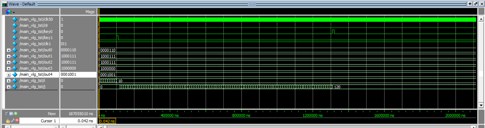
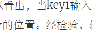

# 上机实验四：FSM时序电路设计

---

- 通信1802  刘增运    学号：1808030220

---

## 第1题：连续序列检测FSM

#### 逻辑描述

设计一个 4 连续 0 或者4 个连续1 的序列检测 FSM，定义一个长序列，在七段管上分别显示检测的 4 个连续 0 和 4 个连续 1 的个数。显示连续 0 和连续 1 的个数在七段管上的显示，分别用函数和任务实现。

| 信号类型 |    变量数据类型及位宽    |                变量含义                 |
| :------: | :----------------------: | :-------------------------------------: |
|  input   |         wire clk         |         系统外部的时钟信号输入          |
|  input   |         wire clr         |                复位信号                 |
|  input   |         wire in          |              外部输入的0/1              |
|  output  |   reg [6:0] out0,out1    |   7段管显示的信号，分别输出0和1的个数   |
|          | reg [2:0] state0，state1 |     中间变量，存放当前0/1的输入个数     |
|  output  | reg[6:0] count0，count1  | 存放连续四个0/1个数的变量，顺便输出观察 |

#### 模块代码

~~~ verilog
module main(clk,clr,in,out0,out1,count0,count1);
    input clk;				
    input clr;				
    input in;				
    output reg[6:0] out0=0,out1=0;
    output reg[6:0] count0=0,count1=0;
    reg[2:0] state0=3'b000,state1=3'b000;		
    
    always@(posedge clk,posedge clr) 
        begin 
            if(clr) 
                begin
                    state0<=0;
                    state1<=0;
                end
            else
                begin
                    if(in)	
                        begin
                            state0<=3'b000;
                            case(state1)
                        	    3'b000: state1<=3'b001;
                        	    3'b001: state1<=3'b010;
                        	    3'b010: state1<=3'b011;
                        	    3'b011: 
                                	begin
                                        state1<=3'b100;
                                        count1=count1+1;
                                	end
                        	    3'b100:state1<=3'b001;
                        	    default: state1<=3'b000;
                            endcase
                        end
                    else
                        begin
                            state1<=3'b000;
                            case(state0)
                        	    3'b000: state0<=3'b001;
                        	    3'b001: state0<=3'b010;
                        	    3'b010: state0<=3'b011;
                        	    3'b011: 
                                	begin
                                        state0<=3'b100;
                                        count0=count0+1;
                                	end
                        	    3'b100:state0<=3'b001;
                        	    default: state0<=3'b000;
                            endcase
                        end
                end
        end
    always@(count0)
        begin
            show(count0,out0);
        end
    always@(count1)
        begin
            show(count1,out1);
        end
    
    task show;
        input integer result;
        output[6:0] out;
        if(result==0) out=7'b0111111; 
		else if(result==1) out=7'b0000110;
		else if(result==2) out=7'b1011011;
        else if(result==3) out=7'b1001111;
        else if(result==4) out=7'b1100110;
        else if(result==5) out=7'b1101101;
        else if(result==6) out=7'b1111101;
        else if(result==7) out=7'b0000111;
        else if(result==8) out=7'b1111111;
        else if(result==9) out=7'b1100111;
        else out=7'b1111111;   
    endtask
endmodule

//函数实现
//function[6:0]  out;
  //  input integer result;
    //if(result==0) out=7'b0111111; 
   // else if(result==1) out=7'b0000110;
  //  else if(result==2) out=7'b1011011;
   // else if(result==3) out=7'b1001111;
   // else if(result==4) out=7'b1100110;
   // else if(result==5) out=7'b1101101;
   // else if(result==6) out=7'b1111101;
    //else if(result==7) out=7'b0000111;
    //else if(result==8) out=7'b1111111;
    //else if(result==9) out=7'b1100111;
   // else out=7'b1111111;
//endfunction

~~~

#### 测试代码

~~~ verilog

`timescale 1 ps/ 1 ps
module main_vlg_tst();
// constants                                           
// general purpose registers
reg eachvec;
// test vector input registers
reg clk=0;
reg clr;
reg in;
// wires                                               
wire [6:0]  out0;
wire [6:0]  out1;
wire [6:0]  count0;
wire [6:0]  count1;

// assign statements (if any) 
main i1 (
// port map - connection between master ports and signals/registers   
	.clk(clk),
	.clr(clr),
	.in(in),
	.out0(out0),
	.out1(out1),
	.count0(count0),
	.count1(count1)
);
always
    begin
       # 10;
       clk=~clk;
    end
initial                                                
	begin
        in=1;
        # 40;
        in=0;
        # 50;
        in=1;
        # 60;
        in=0;
        in=1;
        # 70;
        in=0;
        # 80;
        in=1;
        # 90;
        in=0;
        # 100;
        clr=1;
        # 30;
        clr=0;
		$display("Running testbench");                       
	end  
initial
    $monitor($realtime,,,"0:%d  1:%d",count0,count1);	
endmodule

~~~

#### 测试结果

- 波形图

- 文本输出

#### 结果分析

本题中各用了5个状态来记录0/1出现的次数，每次触发最后一个状态时（即连续检测到4个连续的1或0时），用于记录个数的内部变量自加1，同时将该数值显示在7段数码管上；如果检测到clr复位信号时，所有状态机状态恢复到初始化状态，同时两个计数变量清零，实现一个计数清零的效果。

从实验结果可以看出，当出现 4 个连续 0 或 4 个连续 1 时，out0与out1能正常输出计数结果，且在连续输入1或0时，状态机状态不会产生混乱；经检验，输出结果与功能完全符合题目要求。

---

## 第2题：

#### 逻辑描述

移动速度可控的 HELLO 自动循环显示，当KEY1 按下后，循环速度为每秒移动 1 个七段管的位置，按下 KEY0 后，速度减慢，4 秒移动一个七段管的位置。用 FSM 设计实现。

| 信号类型 |         变量数据类型及位宽         |        变量含义        |
| :------: | :--------------------------------: | :--------------------: |
|  input   |             wire clk50             | 系统外部的时钟信号输入 |
|  output  |             wire clk1              |     分频产生的时钟     |
|  input   |              wire clr              |        复位信号        |
|  input   |           wire key1,key0           |      速度控制按键      |
|  output  | reg [6:0] out0,out1,out2,out3,out4 |    7段管显示的信号     |

#### 模块代码

~~~ verilog 
module main(clk50,clr,clk1,key0,key1,out0,out1,out2,out3,out4);
    input clk50,clr,key0,key1;
    output clk1;
    output reg [6:0] out0;  // 输出到7段管的信号
    output reg [6:0] out1;  // 输出到7段管的信号
    output reg [6:0] out2;  // 输出到7段管的信号
    output reg [6:0] out3;  // 输出到7段管的信号
    output reg [6:0] out4;  // 输出到7段管的信号

    reg [1:0] state=0;   
    reg [2:0] S=3'b000;     // 状态，'HELLO' 'ELLOH' 'LLOHE' 'LOHEL' 'OHELL'
    integer i=0;      

    clk50mto1 dc(clk50,clk1); 

    always@(posedge clr,posedge key0,posedge key1)
        begin
            if(clr)       state=0; 
            else if(key0) state=0; 
            else if(key1) state=1; 
        end

    always @(posedge clk1,posedge clr)
        begin
            if(clr) // 复位
                S=3'b000;
            else
                begin
                    if(state)   
                        begin
                            if(i==3)  
                                begin
                                    i=0;
                                    case(S)
                                        3'b000: S<=3'b001;  
                                        3'b001: S<=3'b010;  
                                        3'b010: S<=3'b011;  
                                        3'b011: S<=3'b100;  
                                        3'b100: S<=3'b000;  
                                        default:S<=3'b000;  
                                    endcase
                                end 
                            else
                                i=i+1;
                        end  
                    else    
                        begin
                            case(S)
                                3'b000: S<=3'b001;  
                                3'b001: S<=3'b010;  
                                3'b010: S<=3'b011;  
                                3'b011: S<=3'b100;  
                                3'b100: S<=3'b000;  
                                default:S<=3'b000;  
                            endcase
                        end 
                end
        end

    always@(S)
        begin
            case(S) 
                3'b000:
                    begin
                        out0=7'b0001001;  
                        out1=7'b0000110;  
                        out2=7'b1000111;  
                        out3=7'b1000111;  
                        out4=7'b1000000;  
                    end
                3'b001: 
                    begin
                        out0=7'b0000110;  
                        out1=7'b1000111;  
                        out2=7'b1000111;  
                        out3=7'b1000000;  
                        out4=7'b0001001;  
                    end
                3'b010: 
                    begin
                        out0=7'b1000111;  
                        out1=7'b1000111;  
                        out2=7'b1000000;  
                        out3=7'b0001001;  
                        out4=7'b0000110;  
                    end
                3'b011: 
                    begin
                        out0=7'b1000111;  
                        out1=7'b1000000;  
                        out2=7'b0001001;  
                        out3=7'b0000110;  
                        out4=7'b1000111;  
                    end
                3'b100: 
                    begin
                        out0=7'b1000000;  
                        out1=7'b0001001;  
                        out2=7'b0000110;  
                        out3=7'b1000111;  
                        out4=7'b1000111;  
                    end
                default:
                    begin
                        out0=7'b0001001;  
                        out1=7'b0000110;  
                        out2=7'b1000111;  
                        out3=7'b1000111;  
                        out4=7'b1000000;  
                    end
            endcase
        end  

endmodule

module clk50mto1(clk50,clk1); 
    input clk50;                
    output reg clk1=1;          
    integer i=0;                
    always@(posedge clk50)      
        begin 
            if(i==25000000)     
                begin 
                    i=0;        
                    clk1=~clk1; 
                end 
            else i=i+1; 
        end 
endmodule 
~~~

#### 测试代码

~~~ verilog
`timescale 1 ns/ 1 ns
module main_vlg_tst();

    reg clk50;
    reg clr;
    reg key0;
    reg key1;

    wire clk1;
    wire [6:0]  out0;
    wire [6:0]  out1;
    wire [6:0]  out2;
    wire [6:0]  out3;
    wire [6:0]  out4;

    integer i=0;
    integer j=0;

    // 产生时钟信号
    // 一个时钟周期为20ns
    parameter DELAY=20; 
    // 半个周期翻转一次
    always #(DELAY/2) clk50=~clk50;

    main i1 (  
        .clk1(clk1),
        .clk50(clk50),
        .clr(clr),
        .key0(key0),
        .key1(key1),
        .out0(out0),
        .out1(out1),
        .out2(out2),
        .out3(out3),
        .out4(out4)
    );
    
    initial                                                
        begin                                                  
            clk50=1;
            clr=0;
            key0=0;
            key1=0;
            // 模拟产生输入信号 
            for(i=0;i<10;i=i+1)
                begin
                    #10000;
                end
            key1=1; #10000 
            key1=0;
            for(j=0;j<120;j=j+1)
                begin
                    #10000;
                end
            key0=1; #10000 
            key0=0;             
        end                                                                        

endmodule
~~~

#### 测试结果

- 波形图

#### 结果分析 

其中用两个变量key0、key1用来记录两种速度，用五个状态来记录五个显示状态，动态循环之后就呈现出一种动态效果。按下速度控制按键时，速度发生变化。

从实验结果可以看出，当key1输入一个高电平时，循环速度为4秒移动 1 个七段管的位置；当key0输入一个高电平时，循环速度为4秒移动 1 个七段管的位置。经检验，输出结果与功能完全符合题目要求。

 

