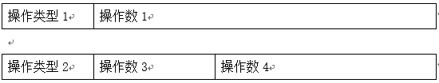
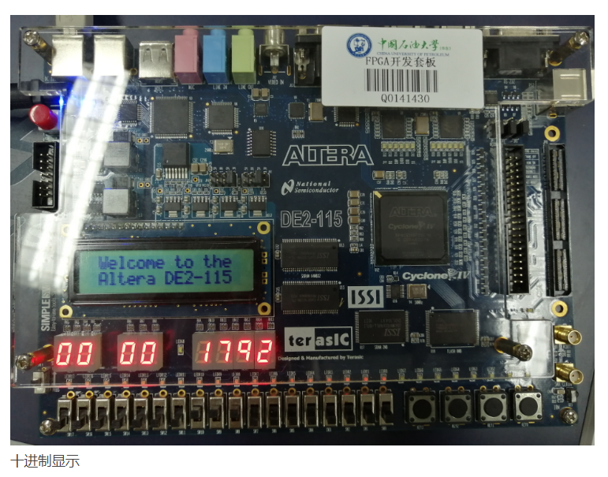
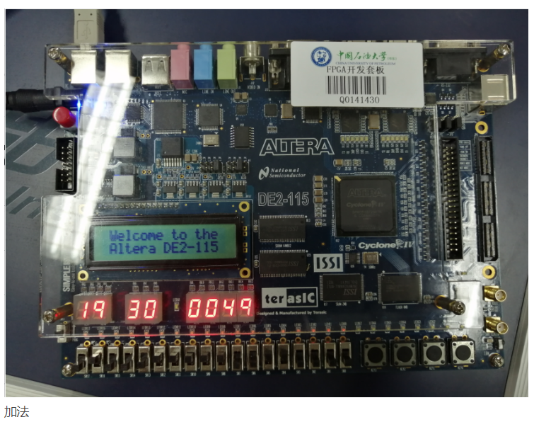
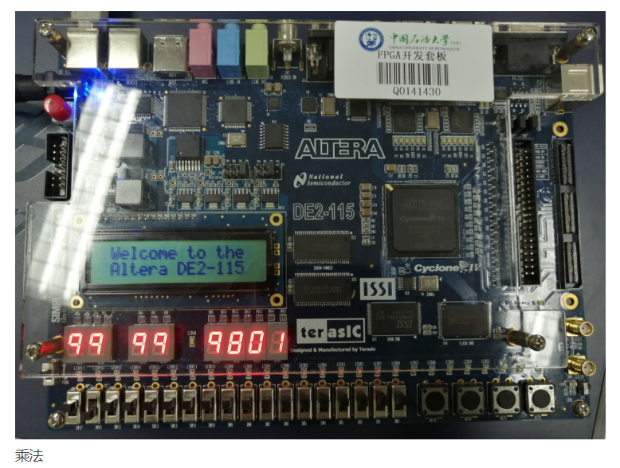
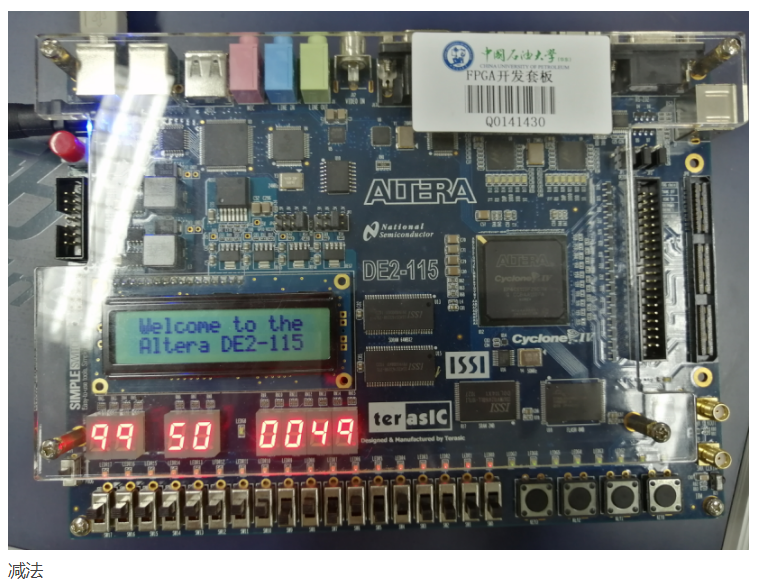
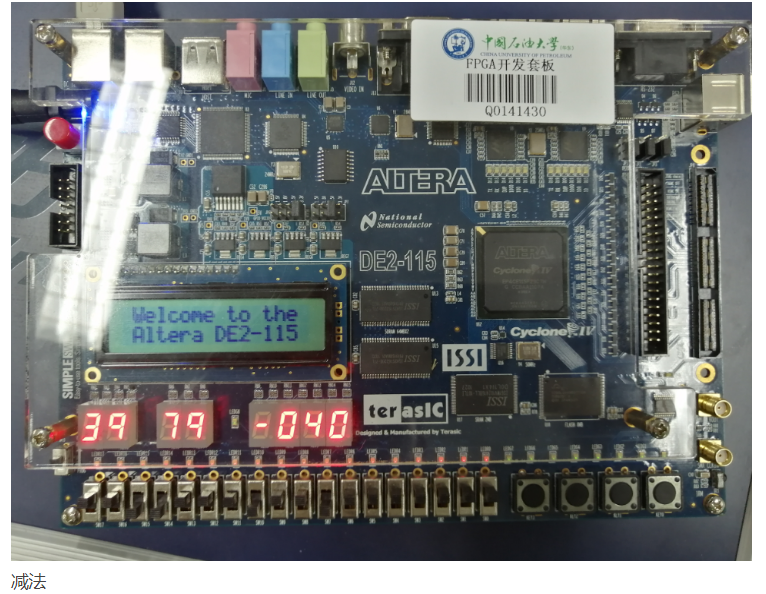

## 一、实验目的

1、掌握QuartusII等实验工具的输入、综合、仿真、下载的使用方法

2、掌握DE2开发版的器件功能特性和使用方法

3、掌握Verilog HDL组合逻辑系统设计的主要方法和技术

4、掌握并应用设计的方法和流程

## 二、预习要求

1、了解QuartusII等管教分配、下载的方法和流程

2、了解开发板输入、输出显示资源的工作特性

3、了解开发板设计、开发和测试的方法和流程

## 三、实验要求

设计一个简单的CPU指令运算器，指令格式如下。

 **完成的具体功能定义如下：**

1、操作类型1：将操作数1作为一个无符号二进制数，在七段管以十进制显示二进制序列等效值。

2、操作类型2：实现操作数3、操作数4之间相加、减、乘的操作，在七段管以十/十六进制进制显示操作数和结果。操作数3和4为BCD码表示的2位十进制数（表示的值为00-99）。

**注意：**

1、操作类型2中，减法逻辑中出现负数，则显示“-”，正数可以不显示符号

2、操作类型2中，加、减、乘操作数和结果都用十进制显示，可以在七段管上进行循环显示来实现。

3、注意操作数3、4以BCD码输入，超过9的BCD码输出处理问题。

4、尝试加法运算采用流水线方式实现。注意有效位数。

5、如果感觉七段管显示能力弱，可以查询LCD1602的控制模块代码，采用LCD显示。

## 四、实验分析和设计

**1、功能定义**

（1）功能切换：使用拨动开关17、16切换开发板的功能，00表示十进制显示，01表示加法运算，10表示乘法，11表示减法。

（2）十进制显示：拨动开关15-0作为输入，将16位二进制转换为最高5位的十进制数，显示在5个数码管上。

（3）加法电路：拨动开关15-8和7-0分别表示两个加数，分别在前两个七段数码管和第三第四个七段数码管显示，运算结果和在后四个七段管显示。

（4）乘法电路：拨动开关15-8和7-0分别表示两个乘数，分别在前两个七段数码管和第三第四个七段数码管显示，运算结果积在后四个七段管显示。

（5）减法电路：拨动开关15-8和7-0分别表示减数和被减数，分别在前两个七段数码管和第三第四个七段数码管显示，运算结果差在后四个七段管显示。如果涉及到小数减大数，能够显示结果中的负号。

**2、设计模块及代码**

Ⅰ、主模块 lab1

~~~ verilog
module lab1(sw,hex0,hex1,hex2,hex3,hex4,hex5,hex6,hex7);
    input[17:0] sw;
    output[6:0] hex0,hex1,hex2,hex3,hex4,hex5,hex6,hex7;
    reg[4:0] h7,h6,h5,h4,h3,h2,h1,h0;
    reg[15:0] o1,o2,s;
    reg[17:0] sw0;

    always@(*)
        begin
            if(sw[3:0]>9) sw0[3:0]=9;
            else sw0[3:0]=sw[3:0];
            if(sw[7:4]>9) sw0[7:4]=9;
            else sw0[7:4]=sw[7:4];
            if(sw[11:8]>9) sw0[11:8]=9;
            else sw0[11:8]=sw[11:8];
            if(sw[15:12]>9) sw0[15:12]=9;
            else sw0[15:12]=sw[15:12];

            if(sw[17:16]==0)
                begin 
                    h7=16;
                    h6=16;
                    h5=16;
                    h0=sw[15:0]%10;
                    h1=sw[15:0]/10%10;
                    h2=sw[15:0]/100%10;
                    h3=sw[15:0]/1000%10;
                    h4=sw[15:0]/10000;
                    show(h0,hex0);
                    show(h1,hex1);
                    show(h2,hex2);
                    show(h3,hex3);
                    show(h4,hex4);
                end
            else if(sw[17:16]==1)
                begin  
                    o1=sw0[15:12]*10+sw0[11:8];
                    o2=sw0[7:4]*10+sw0[3:0];
                    s=o1+o2;
                    h7=sw0[15:12];
                    h6=sw0[11:8];
                    h5=sw0[7:4];
                    h0=s%10;
                    h1=s/10%10;
                    h2=s/100;
                    h3=16;
                    h4=sw0[3:0];
                    show(h0,hex0);
                    show(h1,hex1);
                    show(h2,hex2);
                    show(h3,hex3);
                    show(h4,hex4);
                    show(h5,hex5);
                    show(h6,hex6);
                    show(h7,hex7);
                end
            else if(sw[17:16]==2)
                begin  
                    o1=sw0[15:12]*10+sw0[11:8];
                    o2=sw0[7:4]*10+sw0[3:0];
                    s=o1*o2;
                    h7=sw0[15:12];
                    h6=sw0[11:8];
                    h5=sw0[7:4];
                    h0=s%10;
                    h1=s/10%10;
                    h2=s/100%10;
                    h3=s/1000%10;
                    h4=sw0[3:0];
                    show(h0,hex0);
                    show(h1,hex1);
                    show(h2,hex2);
                    show(h3,hex3);
                    show(h4,hex4);
                    show(h5,hex5);
                    show(h6,hex6);
                    show(h7,hex7);
                end
            else if(sw[17:16]==3)
                begin  
                    o1=sw0[15:12]*10+sw0[11:8];
                    o2=sw0[7:4]*10+sw0[3:0];
                    if(o1>=o2)
                        begin
                            s=o1-o2;
                            h7=sw0[15:12];
                            h6=sw0[11:8];
                            h5=sw0[7:4];
                            h0=s%10;
                            h1=s/10%10;
                            h2=s/100%10;
                            h3=16;
                            h4=sw0[3:0];
                            show(h0,hex0);
                            show(h1,hex1);
                            show(h2,hex2);
                            show(h3,hex3);
                            show(h4,hex4);
                            show(h5,hex5);
                            show(h6,hex6);
                            show(h7,hex7); 
                        end
                    else
                        begin
                            s=o2-o1;
                            h7=sw0[15:12];
                            h6=sw0[11:8];
                            h5=sw0[7:4];
                            h0=s%10;
                            h1=s/10%10;
                            h2=s/100%10;
                            h3=10;
                            h4=sw0[3:0];
                            show(h0,hex0);
                            show(h1,hex1);
                            show(h2,hex2);
                            show(h3,hex3);
                            show(h4,hex4);
                            show(h5,hex5);
                            show(h6,hex6);
                            show(h7,hex7); 
                        end
                end
        end

    task show;
        input reg[3:0] result;			
        output reg[6:0] out;				
        if(result==0) 	 out=7'b1000000;	// 显示0
        else if(result==1) out=7'b1111001;	// 显示1
        else if(result==2) out=7'b0100100;	// 显示2
        else if(result==3) out=7'b0110000;	// 显示3
        else if(result==4) out=7'b0011001;	// 显示4
        else if(result==5) out=7'b0010010;	// 显示5
        else if(result==6) out=7'b0000010;	// 显示6
        else if(result==7) out=7'b1111000;	// 显示7
        else if(result==8) out=7'b0000000;	// 显示8
        else if(result==9) out=7'b0011000;	// 显示9
        else if(result==10)out=7'b0111111;	// 显示-
        else 			 out=7'b1111111;	// 不显示
    endtask
endmodule
~~~

Ⅱ、仿真和测试

- **运行结果**

- **问题和经验总结**

1、第一次接触FPGA开发板，与实验仿真还是有很大的不同的，首先是管脚的导入，这是不得不注意的一点。

2、设计运算器的时候，会遇到减法出现负号的情况，先判断相减是否会出现负号，如果出现，则调换减数与被减数，再将用于显示结果的第一个七段数码管显示为负号，否则无需特别注意。

3、操作数以BCD码的形式输入，需要考虑无用编码状态，此题中将超出编码范围的输入统一认定为十进制数9。

4、将七段数码管的显示功能封装成一个task，需要时可以直接调用。

