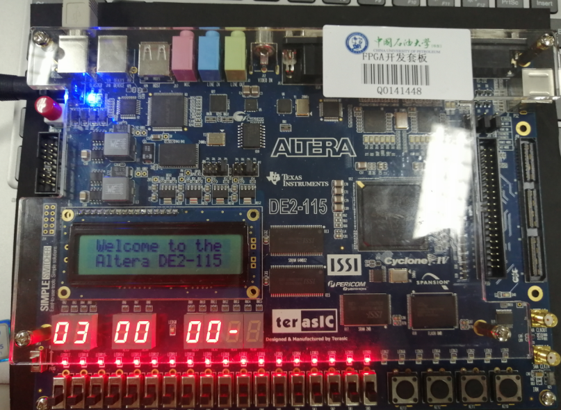
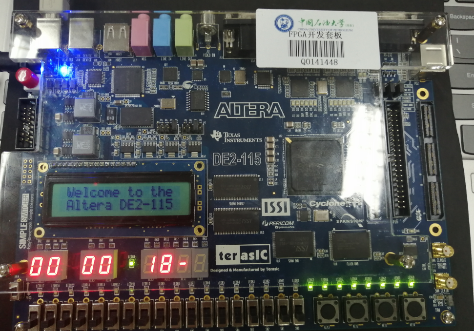
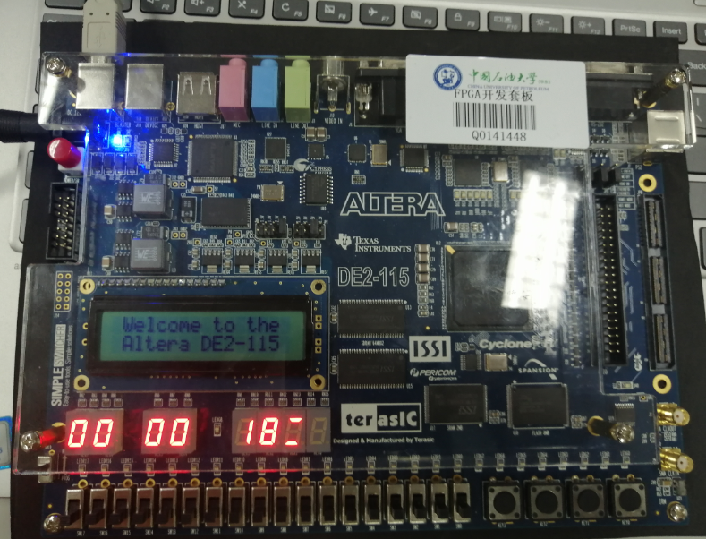

## 一、实验目的

1、掌握QuartusII等实验工具的输入、综合、仿真、下载的使用方法；

2、掌握DE2开发版的器件功能特性和使用方法；

3、掌握Verilog HDL时序逻辑系统设计的主要方法和技术；

4、掌握并应用EDA设计的方法和流程。

## 二、预习要求

1、了解QuartusII等管脚分配、下载的方法和流程；

2、了解开发板输入、输出显示资源的工作特性；

3、了解开发板设计、开发和测试的方法和流程。

## 三、实验要求

**设计一个可调的综合计时器。具体功能：**

1、显示小时、分、秒，提供置零功能。显示在七段管或LCD屏幕上，可以考虑24/12小时模式切换功能。

2、能够对秒、分、小时进行分别修改，可以两位数整体修改或每位独立修改

3、整点报时功能，整点可以显示一定形式的LED来表示。

4、闹钟功能，设定特定时间，到时间以特定LED显示来显示闹钟。注意闹钟持续时间，也可以参考懒人闹钟模式。

## 四、实验分析和设计

**1、功能定义**

（1）功能切换：通过一个按键来切换“计时功能”和闹钟功能，分别显示/调整当前的时间和闹钟。

（2）时钟/闹钟调整：分别调整时钟/闹钟的时分秒，实现调表的效果。

（3）闹钟：每次到达闹钟设置的时间时，会亮起板子上所有的绿灯以示提醒。

（4）整点报时：每次到达整小时时，会亮起板子上所有的红灯以示提醒。

（5）使用倒数第二个数码管表示目前的工作模式，“-”表示工作在计时器模式，“=”表示工作在闹钟调整模式；使用倒数第一个数码管表示目前正在修改的位数，“H”表示修改hour，“F”表示修改minute，“S”表示修改second。

（6）置零：按下置零按键之后实现时钟置零。

**2、设计模块及代码**

Ⅰ、主模块 lab2

~~~ verilog
module lab2(hex0,hex1,hex2,hex3,hex4,hex5,hex6,hex7,key,ledr,ledg,clk_50);
    input clk_50;//50MHz时钟
    input[3:0] key;//四个按键
    output reg[6:0] hex0,hex1,hex2,hex3,hex4,hex5,hex6,hex7;//七个数码管输出
    output reg[17:0] ledr=18'b000000000000000000;//红灯，初始化为灭
    output reg[8:0] ledg=9'b000000000;//绿灯，初始化为灭
    reg[8:0] ztimer=0,ntimer=0;//计时器，控制灯亮的时间
    reg[9:0] hour=0,minute=0,second=0,nhour=11,nminute=11,nsecond=11,th=0,tm=0,ts=0;//计时器和闹钟的时分秒
    reg[5:0] state=0,zstate=0,nstate=0,temp=0,t1,t2,t3,t4,t5,t6;//1、切换时钟与闹钟 2、切换时钟调整时的时分秒  3、切换闹钟调整时的时分秒

    divclk dc(clk_50,clk1);//

    always@(negedge key[2])//改state
        begin
            state=(state+1)%2;
        end

    always@(negedge key[1])//改zstate和nstate
        begin
            temp=state;
            if(temp==0)//如果在计时状态
                begin
                    zstate=(zstate+1)%4;
                end
            else//闹钟状态
                begin
                    nstate=(nstate+1)%4;
                end
        end

    always@(negedge key[0])//增加
        begin
            t4=state;
            t5=zstate;
            t6=nstate;
            th=hour;
            tm=minute;
            ts=second;
            if(t4==0)//如果在计时状态
                begin
                    if(t5==1)
                        begin
                            if(th==23) th=0;
                            else th=th+1;
                        end
                    if(t5==2)
                        begin
                            if(tm==59) tm=0;
                            else tm=tm+1;
                        end
                    if(t5==3)
                        begin
                            if(ts==59) ts=0;
                            else ts=ts+1;
                        end
                end
            else//闹钟状态
                begin
                    if(t6==1)
                        begin
                            if(nhour==23) nhour=0;
                            else nhour=nhour+1;
                        end
                    if(t6==2)
                        begin
                            if(nminute==59) nminute=0;
                            else nminute=nminute+1;
                        end
                    if(t6==3)
                        begin
                            if(nsecond==59) nsecond=0;
                            else nsecond=nsecond+1;
                        end
                end
        end

    always@(posedge clk1,negedge key[3])
        begin
            t1=state;
            t2=zstate;
            t3=nstate;
            if(!key[3])//按下置零
                begin
                    hour=0;
                    minute=0;
                    second=0;
                    show(hour/10,hex7);
                    show(hour%10,hex6);
                    show(minute/10,hex5);
                    show(minute%10,hex4);
                    show(second/10,hex3);
                    show(second%10,hex2);
                    show(10,hex1);
                    show(zstate+12,hex0);
                end
            else//clk1来了
                begin
                    if(t1==0)
                        begin
                            if(t2==0)
                                begin
                                    //下面是正常的计时
                                    if(second==59)
                                        begin
                                            second=0;
                                            if(minute==59)
                                                begin
                                                    minute=0;
                                                    if(hour==23) hour=0;
                                                    else hour=hour+1;
                                                end
                                            else minute=minute+1;
                                        end
                                    else
                                        begin
                                            second=second+1;
                                        end
                                    show(hour/10,hex7);
                                    show(hour%10,hex6);
                                    show(minute/10,hex5);
                                    show(minute%10,hex4);
                                    show(second/10,hex3);
                                    show(second%10,hex2);
                                    show(10,hex1);
                                    show(12,hex0);
                                    //以上是正常的计时,以下是报时和闹钟
                                    if(minute==0&&second==0) ztimer=59;
                                    else ztimer=0;
                                    if(hour==nhour&&minute==nminute&&second==nsecond) ntimer=59;
                                    else ntimer=0;
                                    if(ztimer>0)
                                        begin
                                            ledr=18'b111111111111111111;//亮红灯 
                                            ztimer=ztimer-1;
                                        end
                                    else    ledr=18'b000000000000000000;//关红灯
                                    if(ntimer>0)
                                        begin
                                            ledg=9'b111111111;//亮绿灯 
                                            ntimer=ntimer-1;
                                        end
                                    else    ledg=9'b000000000;
                                end
                            else if(t2==1)
                                begin
                                    hour=th;
                                    show(hour/10,hex7);
                                    show(hour%10,hex6);
                                    show(minute/10,hex5);
                                    show(minute%10,hex4);
                                    show(second/10,hex3);
                                    show(second%10,hex2);
                                    show(10,hex1);
                                    show(t2+12,hex0);
                                end
                            else if(t2==2)
                                begin
                                    minute=tm;
                                    show(hour/10,hex7);
                                    show(hour%10,hex6);
                                    show(minute/10,hex5);
                                    show(minute%10,hex4);
                                    show(second/10,hex3);
                                    show(second%10,hex2);
                                    show(10,hex1);
                                    show(t2+12,hex0);
                                end
                            else if(t2==3)
                                begin
                                    second=ts;
                                    show(hour/10,hex7);
                                    show(hour%10,hex6);
                                    show(minute/10,hex5);
                                    show(minute%10,hex4);
                                    show(second/10,hex3);
                                    show(second%10,hex2);
                                    show(10,hex1);
                                    show(t2+12,hex0);
                                end
                        end
                    else if(t1==1)
                        begin
                            show(nhour/10,hex7);
                            show(nhour%10,hex6);
                            show(nminute/10,hex5);
                            show(nminute%10,hex4);
                            show(nsecond/10,hex3);
                            show(nsecond%10,hex2);
                            show(11,hex1);
                            show(nstate+12,hex0);
                        end
                end
        end

    task show;
        input reg[3:0] result;			
        output reg[6:0] out;				
        if(result==0) 	 out=7'b1000000;	// 显示0
        else if(result==1) out=7'b1111001;	// 显示1
        else if(result==2) out=7'b0100100;	// 显示2
        else if(result==3) out=7'b0110000;	// 显示3
        else if(result==4) out=7'b0011001;	// 显示4
        else if(result==5) out=7'b0010010;	// 显示5
        else if(result==6) out=7'b0000010;	// 显示6
        else if(result==7) out=7'b1111000;	// 显示7
        else if(result==8) out=7'b0000000;	// 显示8
        else if(result==9) out=7'b0011000;	// 显示9
        else if(result==10)out=7'b0111111;	// 显示-
        else if(result==11)out=7'b1110110;	// 显示=
        else if(result==12)out=7'b1111111;	// 显示“  ”
        else if(result==13)out=7'b0001001;	// 显示H
        else if(result==14)out=7'b0001110;	// 显示F
        else if(result==15)out=7'b0010010;	// 显示S
        else 			 out=7'b1111111;	// 不显示
    endtask

endmodule
~~~

Ⅱ、分频模块divclk

~~~ verilog
module divclk(clk_50,clk1); 
    input clk_50;		// clk50：输入50MHz信号；reset：复位信号 
    output reg clk1=1;	 // clk1：新产生的1Hz信号 
    integer i=0;			 
    always@(posedge clk_50) 
        begin 
            if(i==25000000) 
                begin 
                    i=0; 
                    clk1=~clk1;
                end 
            else i=i+1; 
        end 
endmodule 
~~~

Ⅲ、仿真和测试

- **运行结果**

> 调整分钟

> 整点报时

> 闹钟提醒

> 设置闹钟

- **问题和经验总结**

1、使用倒数第二个数码管表示目前的工作模式，“-”表示工作在计时器模式，“=”表示工作在闹钟调整模式。

2、使用倒数第一个数码管表示目前正在修改的位数，“H”表示修改hour，“F”表示修改minute，“S”表示修改second。

3、将七段数码管的显示功能封装成一个task，需要时可以直接调用。

4、最开始的时候将所有的触发信号信号都放到一个always中，发现内部紊乱，系统无法正确处理每一个触发信号，后来分开成同步信号之后解决，但是由于不同的always过程不能对同一变量进行赋值，所以用了很多中间变量，来临时存储数据。