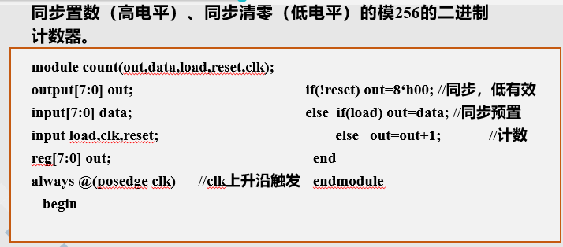

### EDA学习期间所有的资料了！！！

## 2020-2021-1《EDA 设计基础》考试说明  

**1、 考试时间：**12 月 13 日，14：00-16：00，微 301 

**2、 考试注意事项：**

（1）携带学生证或者打印证明  

（2）开卷，只能携带纸质材料  

**3、 考试内容范围：**仅考察 verilog 语法、程序设计相关内容。

**4、 考试题型：**

（1）  选择题 10 题，20 分；  

（2）  程序阅读（补齐代码）4-5 段代码，15 空，共 30 分。  

（3）  编程题 4 题，共 50 分。  

**5、 考试重点：**  

### （1）基础语法：  

- #### 关键字、标识符格式、常量定义格式  

- #### 变量定义类型，net 和 variable 两大类；wire、reg 和 integer3 中常用的数据类型。  

- #### 数据类型的判断，always 或 initial 中被赋值的变量一定是 variable（reg 或 integer）类型。其他 assign、门原件调用的输出、模块调用的输出都是 wire 类型。  

- #### parameter 常量定义的两种格式和调用的格式；  

- #### 向量和标量基本操作；运算符的基本功能，特别注意｛｝  

- #### always 和 intial 的适用范围和区别

 在一个模块（module）中：

 initial语句常用于仿真中的初始化，always可用于仿真和可综合电路

 initial过程块中的语句仅执行一次，always块内的语句则是不断重复执行的

 使用 initia和 always语句的次数是不受限制的。

- #### always 敏感列表格式，同步/异步、高低电平、上升沿/下降沿关系 

~~~verilog
格式：
always@(<敏感信号表达式event-expression>)
    begin
        xxxxxxxxxxxxxxxxxxxxxxxxxxxxxxx
        xxxxxxxxxxxxxxxxxxxxxxxxxxxxxxx
    end
//“always”过程语句通常是带有触发条件的，触发条件写在敏感信号表达式中，只有当触发条件满足时， “begin-end”块语句才能被执行。

always@(a)    	//当信号a的值发生改变
always @(a ，b)   //当信号a或信号b的值发生改变
always @*或@（*）  //所有驱动信号

~~~

出现在敏感列表中的使能信号，都是异步信号，不出现是同步；

异步使能信号，posedge对应高电平有效，negedge对应低电平有效。

- #### 阻塞和非阻塞赋值的区别，<=和=适用范围。  

**非阻塞（non_blocking）赋值方式**      •赋值符号为“<=”， 如：b<= a；

非阻塞赋值在整个过程块结束时才完成赋值操作，即b的值并不是立刻就改变的。

**阻塞（blocking）赋值方式**      •赋值符号为“=”， 如：b= a；

阻塞赋值在该语句结束时就立即完成赋值操作，即b的值在该条语句结束后立刻改变。

> 组合逻辑使用阻塞赋值“=”；
> 时序使用非阻塞“<=”；

- #### 函数/任务/模块定义和调用。  

函数

~~~ verilog
function<返回值位宽或类型说明>函数名；
端口声明；
局部变量定义；
其它语句。
endfunction

function[7:0]  get0;
input[7:0] x; reg[7:0] count;
integer i;
begin	 
   count=0;
   for (i=0;i<=7;i=i+1)
       if(x[i]=1'b0) count=count+1;
   get0=count;//函数必须对函数名赋值
end
endfunction

//调用
a=get0(8'b00001111);
~~~

### （2）程序设计  

- #### 组合逻辑设计（基本逻辑、条件完备性、优先级）  

带优先级的数据选择器、

~~~ verilog
module mux_casez(out,a,b,c,d,sel);
    input a,b,c,d;
    input[3:0] sel;
    output reg out;
    always@(a or b or c or d or sel) 
        begin
            casez(sel)
                4’b???1:out=a;
                4’b??10:out=b;
                4’b?100:out=c;
                4’b1000:out=d;
                default:out=1’bx;
            endcase
        end
~~~

- #### 时序逻辑（二进制计数器、BCD码计数器）  

- #### 流水线

以8位全加器为例

~~~ verilog
//两级流水线
module add2(cout,sum,ina,inb,cin,clk);
    input[7:0] ina,inb;
    input cin,clk;//接收上一级进位,clk
    output reg[7:0] sum;
    output reg cout;
    reg[3:0] ta,tb,f3210;
    reg fjin;
    always@(posedge clk)
        begin
            {fjin,f3210}=ina[3:0]+inb[3:0]+cin;//计算后四位，并且保留进位
            ta=ina[7:4];//锁存高四位，留着下一个clk运算
            tb=inb[7:4];
        end
    always@(posedge clk)
        begin
            sum[3:0]=f3210;//取过来低四位
            {cout,fjin}=ta+tb+fjin;//运算高四位
        end
endmodule
~~~

~~~ verilog
module  pipeline(cout,sum,ina,inb,cin,clk);
    output[7:0]  sum;
    output  cout;
    input[7:0] ina,inb;
    input  cin,clk; 
    reg[7:0] tempa,tempb,sum;
    reg  tempci,firstco,secondco,thirdco, cout;
    reg[1:0]  firsts, thirda,thirdb;
    reg[3:0]  seconda, secondb, seconds; 
    reg[5:0]  firsta, firstb, thirds;
    always @(posedge clk)
        begin tempa=ina;  tempb=inb;  tempci=cin; 
        end 	  //输入数据缓存
    always @(posedge clk)
        begin {firstco,firsts}=tempa[1:0]+tempb[1:0]+tempci;  //第一级加（低2位）
            firsta=tempa[7:2]; firstb=tempb[7:2]; 
        end//未参加计算的数据缓存
    always @(posedge clk)
        begin {secondco,seconds}={firsta[1:0]+firstb[1:0]+firstco,firsts}; 
            seconda=firsta[5:2]; secondb=firstb[5:2]; 
        end  //数据缓存
    always @(posedge clk)
        begin {thirdco,thirds}={seconda[1:0]+secondb[1:0]+secondco,seconds};
            thirda=seconda[3:2];thirdb=secondb[3:2]; 
        end	 //数据缓存
    always @(posedge clk)
        begin 
            {cout,sum}={thirda[1:0]+thirdb[1:0]+thirdco,thirds}; //第四级加（高两位相加）
        end  
endmodule

~~~

- #### 状态机（一段、两段、三段式）  

~~~verilog
//三段式模5计数器
module fsm(clk,clr,cout)
    input clk,clr;
    output reg[3:0] cout;
    reg[3:0] state,nextstate;
    always@(posedge clk,posedge clr)//修改现在的状态
        begin
            if(clr) state<=3'b000;
            else state<=nextstate;
        end
    always@(state)//修改次态
        begin
            case(state)
                3'b000:nextstate<=3'b001;
                3'b001:nextstate<=3'b010;
                3'b010:nextstate<=3'b011;
                3'b011:nextstate<=3'b100;
                3'b100:nextstate<=3'b000;
                default:nextstate<=3'b000;
            endcase
        end
    always@(state)//修改输出
        begin
            cout=state;
        end
endmodule
~~~

- #### 测试代码（时钟信号、输入信号、输出）

~~~ verilog
//七裁判电路的测试
`timescale 1ps/1ps
module test
    reg out;
    reg[6:0] i=0;
    main obj(i[0],i[1],reg[2],i[3],i[4],i[5],i[6]);
    initial
        begin
            for(i=0;i<127;i++)
                begin
                    #100;
                end
        end
    initial
        $monitor(xxxxxxxxxxxxxxxxxxxxxxxxxxxxxxxxxxxxxxxxxx)
endmodule
~~~

